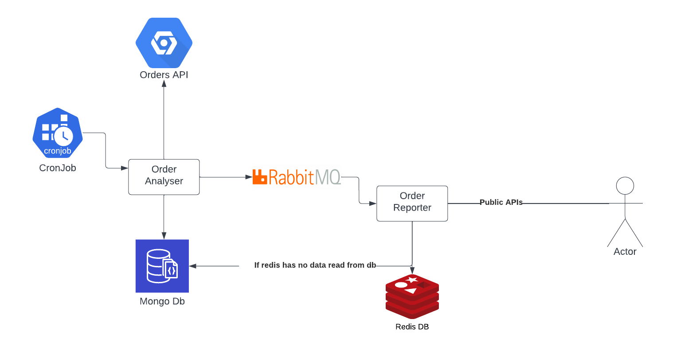

## Introduction
Repository contains docker compose file for deploying the orders-reporter distributed system.

## Services
`Orders Analyser service` -> Orders analyser is a part of reporter distributed system.
The service is responsible for getting data from orders API
using this URL.

Link: https://github.com/nairi-abgaryan/orders-reporter-infra/tree/master/orders-analyser


`Product Reporter service` -> Product reporter is a part of the orders reporter distributed system.
This reader service is responsible for subscribing to the RabbitMQ message broker for receiving reported data from the orders analyser service. Data stored in Redis cache for instant response.
If Redis does not provide data, it requests to shared MongoDB.

Link: https://github.com/nairi-abgaryan/orders-reporter-infra/tree/master/product-reporter

## Architecture Diagram





## Datastores in use
MongoDb - Used as a persistent database to keep normalized data to provide statistics

Redis DB - Used for returning instant reports from cache

## Instalation

**Requirements**

`  1. docker machine `

```bash
$ git clone https://github.com/nairi-abgaryan/orders-reporter-infra.git
$ docker-compose up
```

## Testing APIs
http://localhost:3001/products/profit/top

http://localhost:3001/products/orders-count/top

http://localhost:3001/products/orders-count-from-yesterday/top


## Docker compose 

```yaml   
version: '3.7'

services:
  order_analyser:
    build: https://github.com/nairi-abgaryan/orders-analyser.git
    container_name: order_analyser
    ports:
      - "8080:8080"
    environment:
      DB_CONNECTION_URL: mongodb://mongo-container:27017/orders
    networks:
      - local_network

  product_reporter:
    build: https://github.com/nairi-abgaryan/product-reporter.git
    ports:
      - "8081:8081"
    environment:
      NODE_ENV: development
      container_name: product_reporter
      PORT: 8081
      REDIS_URL: redis://:password123@redis:6379/
      DB_CONNECTION_URL: mongodb://mongo-container:27017/orders
      MQ_URL: amqp://rabbitmq:5672
    networks:
      - local_network

  database:
    container_name: mongo-container
    image: mongo
    environment:
      POSTGRES_DB: messaging_local
      POSTGRES_USER: user_messaging
      POSTGRES_PASSWORD: password_messaging
    ports:
      - "27017-27019:27017-27019"
    volumes:
        - ./init-mongo.js:/docker-entrypoint-initdb.d/init-mongo-js:ro
        - ./mongo-volume:/data/db
    networks:
      - local_network
  redis:
    restart: always
    container_name: redis
    image: redis:latest
    ports:
      - '6379:6379'
    networks:
      - local_network

  rabbitmq:
    container_name: rabbitmq
    image: rabbitmq:3-management-alpine
    ports:
      - 5672:5672
      - 15672:15672
    networks:
      - local_network

networks:
  local_network:
    driver: bridge

```
